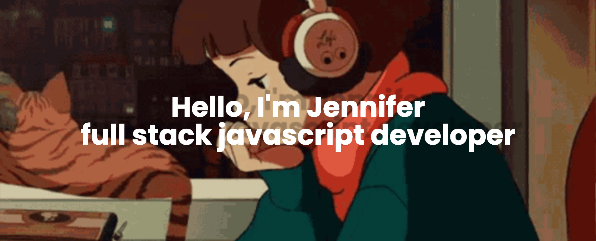

  

  

  <h1 style="font-size: 40px;">About Me</h1>

I'm an aspiring software engineer with a background in healthcare and education. I received my bachelor's degree in Political Science with a focus on International Relations at Columbia University. Currently, I'm learning Java and Android development.

  <h1 style="font-size: 40px;"> 📊 My Stats</h1>

#  My Stats

<!-- 

 -->

